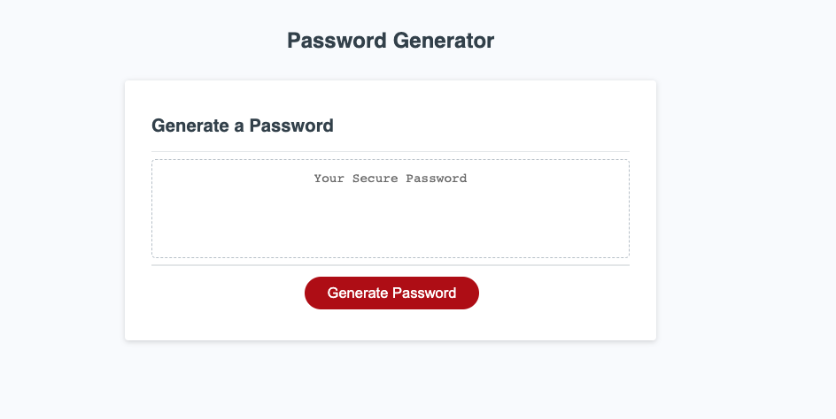
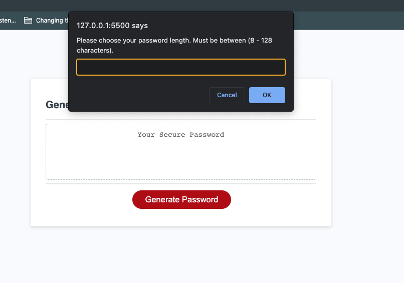
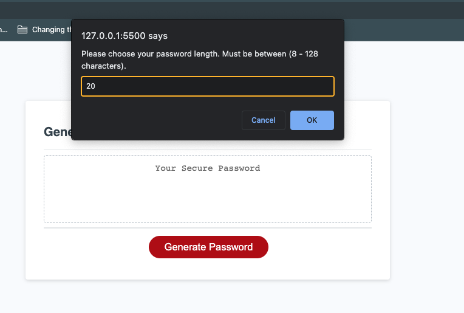
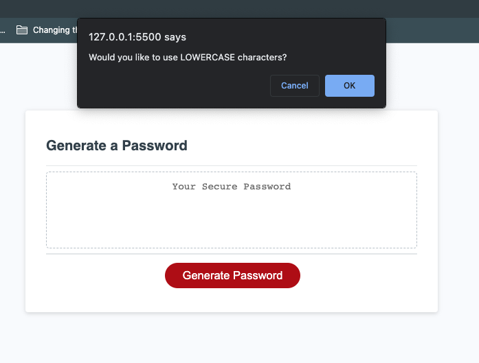
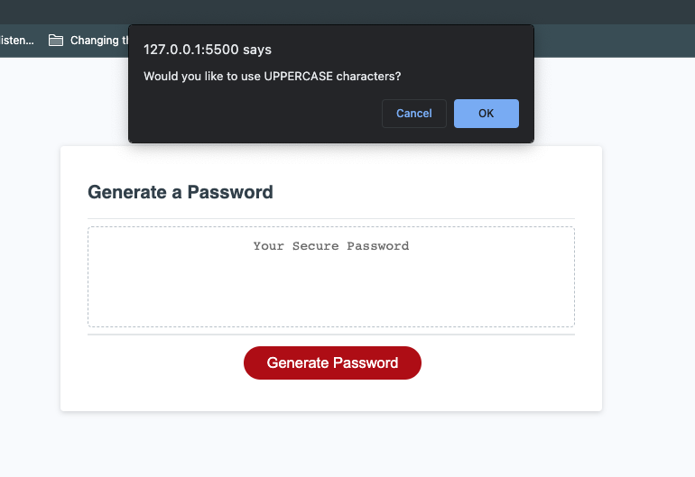
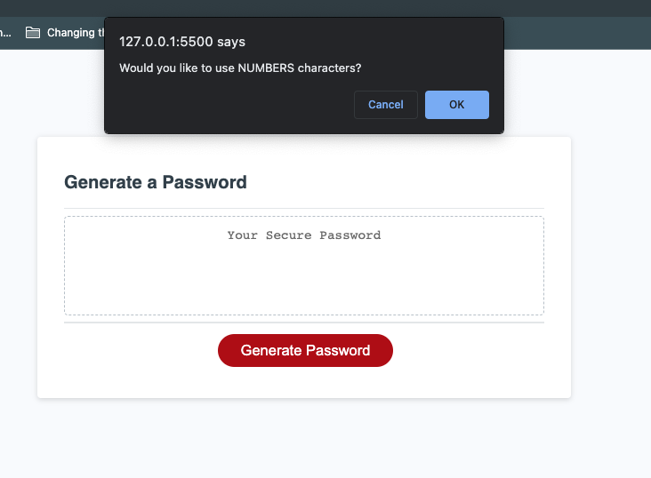
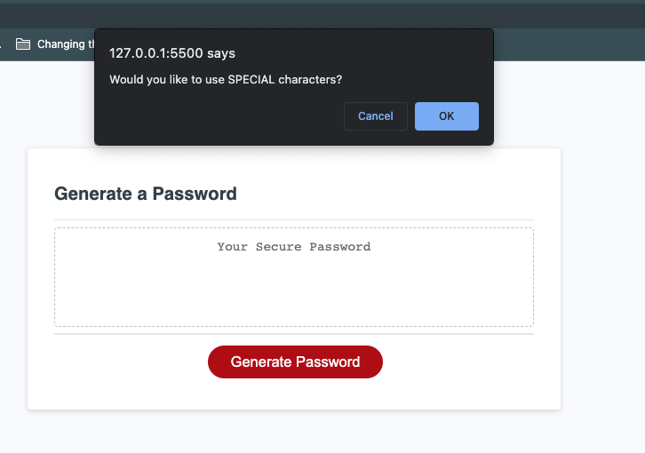
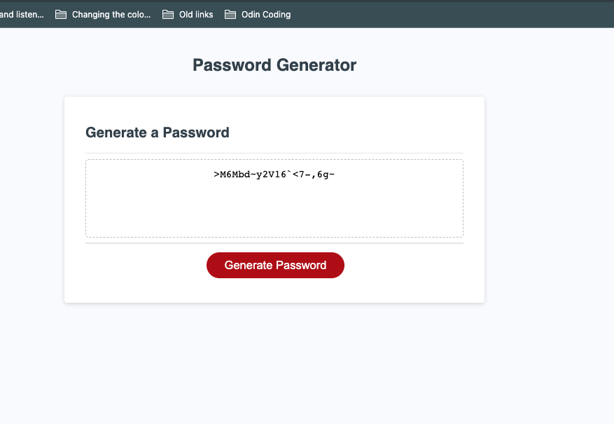
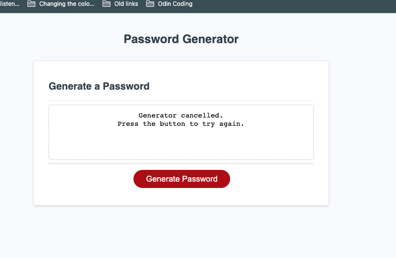
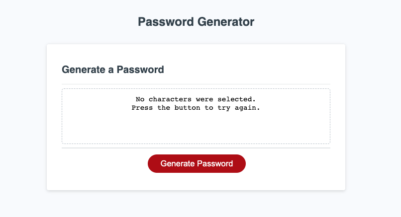

# Random-Password-Generator
Testing out Javascript to make a password generator.

## Deployed Repo
[Random Passsword Generator](https://syntaxsemantixs.github.io/random-password-generator/)

## Description

My motivation for making this project was to create my first JavasScript project. This was the first time using creating a function to apply interactivity between prompts and confirm messages. While taking in user input from to create varying ouputs based off the response of the user. The point of this project was to create a password generator to give out a random password based off the users choice of length. Once the length is selected they are given a choice to choose from the types of characters they would like. The choices were : Lowercase, Uppercase, Numbers or Special Characters. I learned how to structure my code in a way to allow for all the outputs varities. 

## Usage

### Start Screen

### Select Screen

### Input

### Lowercase Selection

### Uppercase Selection

### Numbers Selection

### Special Character Selection

### Result

### Select Screen (Selecting Cancel or (OK without any input.)

### Cancel Message Appears

### No Character Selected Screen

- This only occurs when you select an a length, but you cancel all the confirm prompts.

## MIT License